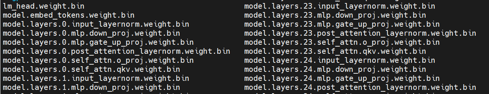

**steps to download HF llama weights and convert to bin file**

1. download weight from https://huggingface.co/meta-llama/Llama-2-7b/tree/main, note that maybe apply for access first

2. run `python convert_downloaded_llama_weights.py --input_dir /path/to/downloaded/llama/weights --model_size 7B --output_dir /output/path` and then, we can get some output files

3. based on files got by step 2, we run `python weights_convert.py -i path/to/step2's_output_dir -o path/to/final_bin_file`

then we can get the weights like below pic:

4. at this time, the weight is ready, and replace the weight path in user_entry.cpp by your step3's output path

**note**
1. 下载Llama-2-7b-hf这个模型也是可以的，但是它不需要做以上的step2，直接做step3即可
2. 下载Llama-2-7b-chat-hf这个模型是无法复现出课程结果的，这个模型的weight和Llama-2-7b-hf的weight不一样
3. 针对之前有同学反馈的无法复现出课程视频所示结果，修改代码weights_convert.py的97和115行的np.hstack为np.vstack即可，拿qkv linear来举例，我们想要计算的是y=x * (w^T) (这个等价于torch.nn.linear)，但是hstack后，x.shape = [num tokens, hidden units], w.shape=[4096, 4096 * 3]，很明显x*(w^T)不成立，搞人的地方在于cublas接收这种shape的数据时居然没有报错。如果是vstack，w.shape=[4096 * 3, 4096]，恰好x*(w^T)符合矩阵乘法维度规则
